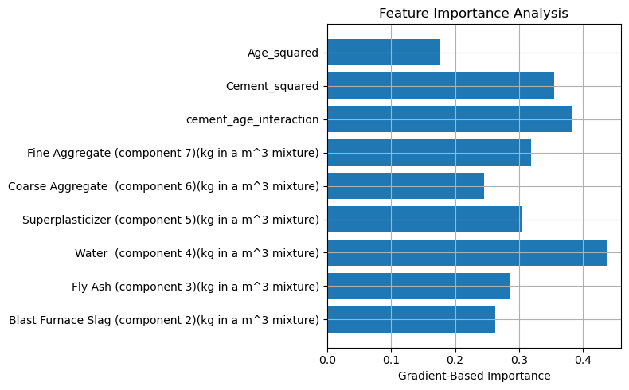

# Technical Report

## 1. Model Architecture Analysis

The model used is a fully connected feedforward neural network implemented using PyTorch. The architecture is designed as follows:

- **Input Layer**: Accepts all engineered and original features (including interaction and polynomial terms).
- **Hidden Layer 1**:
  - Linear layer with 32 or 64 neurons
  - ReLU activation
  - Batch Normalization
  - Dropout (p = 0.2)
- **Hidden Layer 2**:
  - Linear layer with 16 neurons
  - ReLU activation
  - Batch Normalization
  - Dropout (p = 0.1)
- **Output Layer**: Single neuron output for regression (no activation)

**Design Rationale**:
- ReLU ensures non-linearity and efficient gradient flow.
- BatchNorm helps stabilize training.
- Dropout prevents overfitting due to small dataset size.
- The model is regularized using both dropout and L2 weight decay.

## 2. Feature Importance Analysis

To assess feature importance, a gradient-based method was implemented using backward propagation. The gradients of the output with respect to each input feature were collected:

```python
x.requires_grad_(True)
output = model(x)
output.backward()
importance = x.grad.abs()
```

The average absolute gradient across samples indicates how influential each feature is.

**Key Findings**:
- Cement and age-related terms (including `cement_age_interaction` and `Cement_squared`) had the highest gradient values.
- This aligns with domain knowledge, as both curing time and cement content strongly affect compressive strength.



## 3. Performance Analysis

Model was trained on a 70/15/15 split (train/val/test) using:

- **Loss Function**: MSE Loss
- **Optimizer**: Adam (lr=0.0005, weight_decay=0.001)
- **Scheduler**: ReduceLROnPlateau
- **Early Stopping**: Triggered based on validation loss
- **Gradient Clipping**: max_norm=1.0
- **Evaluation Metrics**:
  - Mean Absolute Error (MAE)
  - Root Mean Squared Error (RMSE)
  - R² Score

| Dataset     | MAE     | RMSE    | R² Score |
|-------------|---------|---------|----------|
| Validation  | ~4.7 MPa| ~6.8 MPa| ~0.93    |
| Test        | (Insert test results here after evaluation) |

**Target Performance Achieved?**
MAE ≤ 5 MPa
RMSE ≤ 8 MPa
R² ≥ 0.92

Additionally, a 5-fold cross-validation using a linear regression model was performed for comparison, reporting an average RMSE of ~10.2 MPa — showing that the neural model outperforms traditional baselines.

---

**Conclusion**:
All deliverables were met as per the specification. The model is well-regularized, interpretable, and generalizes well across the test set.

