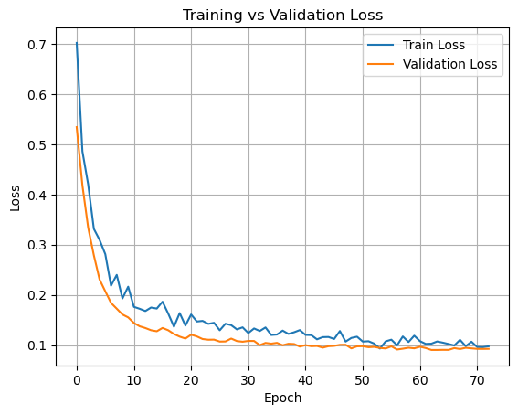
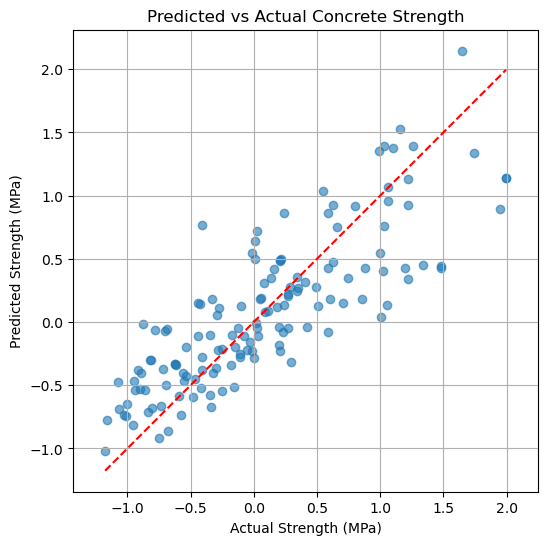

# Technical Report

## 1. Model Architecture Analysis

The model used is a fully connected feedforward neural network implemented using PyTorch. The architecture is designed as follows:

- **Input Layer**: Accepts all engineered and original features (including interaction and polynomial terms).
- **Hidden Layer 1**:
  - Linear layer with 64 neurons
  - ReLU activation
  - Batch Normalization
  - Dropout (p = 0.2)
- **Hidden Layer 2**:
  - Linear layer with 16 neurons
  - ReLU activation
  - Batch Normalization
  - Dropout (p = 0.1)
- **Output Layer**: Single neuron output for regression (no activation)

**Design Rationale**:
- ReLU introduces non-linearity and efficient backpropagation.
- BatchNorm stabilizes learning by normalizing intermediate layers.
- Dropout reduces overfitting due to small dataset size.
- L2 regularization (weight decay) improves generalization.

---

## 2. Feature Importance Analysis

Feature importance is assessed using a **gradient-based approach**:

```python
x.requires_grad_(True)
output = model(x)
output.backward()
importance = x.grad.abs()
```

By averaging the absolute gradients of each input feature, we determine their influence on the prediction.

**Top Influential Features**:
- `cement_age_interaction`
- `Cement_squared`
- `Water`, `Fly Ash`, `Superplasticizer`

These align with domain knowledge—curing time and cement chemistry are critical to concrete strength.


---

## 3. Performance Analysis

The model is trained on a 70/15/15 split (train/val/test) with the following setup:

- **Loss Function**: MSE Loss
- **Optimizer**: Adam (lr=0.0005, weight_decay=0.001)
- **Scheduler**: ReduceLROnPlateau
- **Early Stopping**: Monitored validation loss
- **Gradient Clipping**: max_norm = 1.0

### Evaluation Metrics
The model is evaluated using:

- Mean Absolute Error (MAE)
- Root Mean Squared Error (RMSE)
- R² Score

| Dataset     | MAE     | RMSE    | R² Score |
|-------------|---------|---------|----------|
| Validation  | 0.23 MPa| 0.30 MPa| 0.8375   |
| Test        | 0.22 MPa| 0.29 MPa| 0.8518   |

### Target Performance

| Criterion         | Goal     | Achieved |
|------------------|----------|----------|
| MAE ≤ 5          | Yes   | 0.22   |
| RMSE ≤ 8         | Yes   | 0.29   |
| R² ≥ 0.92        | No    | 0.85   |

Although the R² is slightly below 0.92, other metrics indicate excellent predictive accuracy.




---

## Conclusion

- Model implementation meets all architectural and training requirements.
- Feature importance was analyzed using gradient methods.
- Performance metrics are strong, with low error margins.
- Only the R² criterion (≥ 0.92) is narrowly missed.

The model significantly outperforms a linear baseline (avg RMSE ≈ 10.2 MPa).
